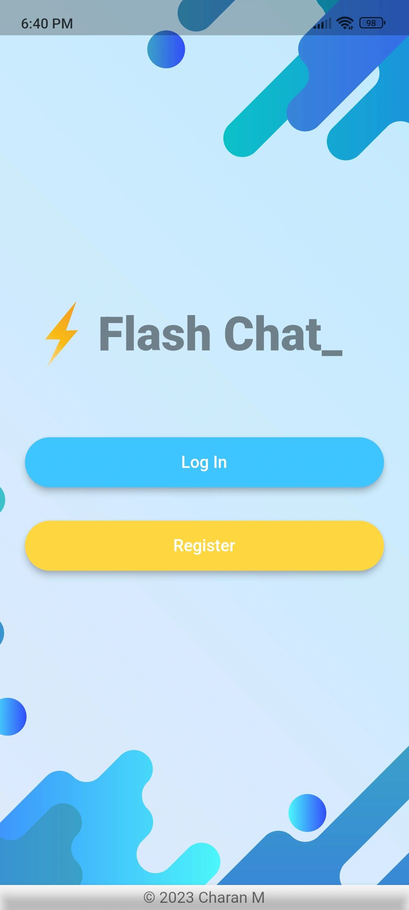
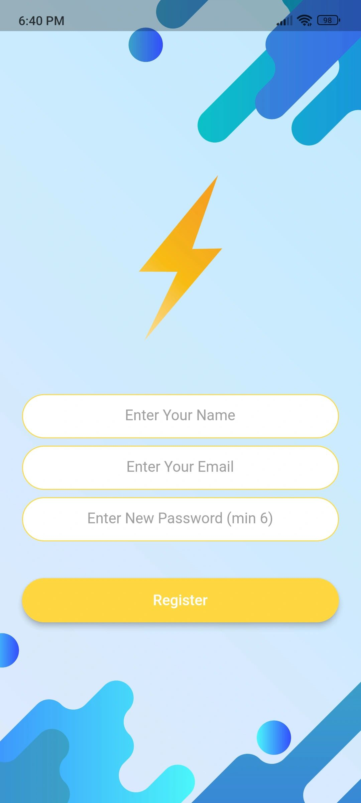
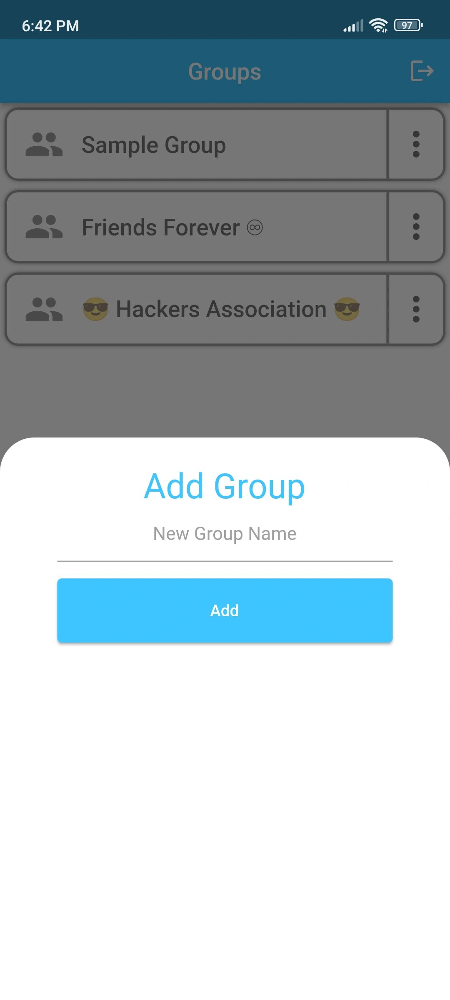
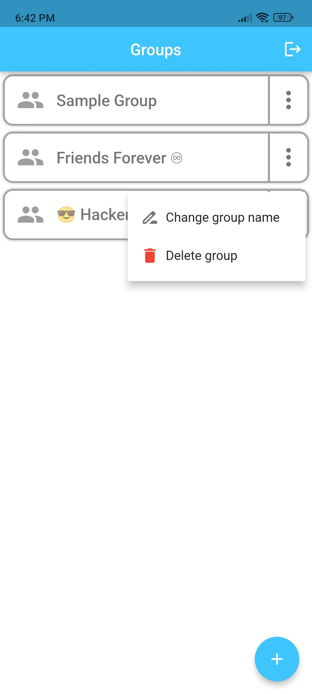
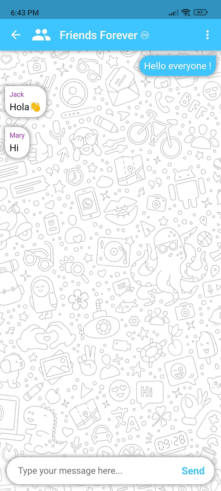
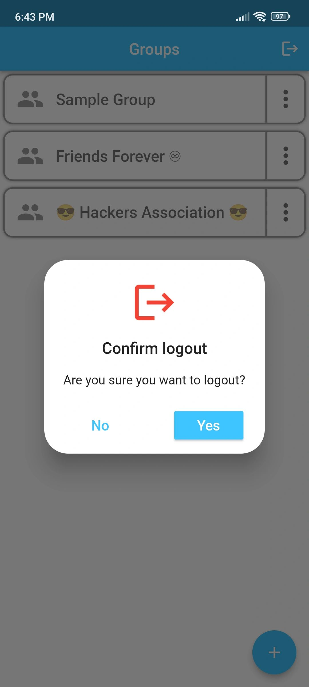
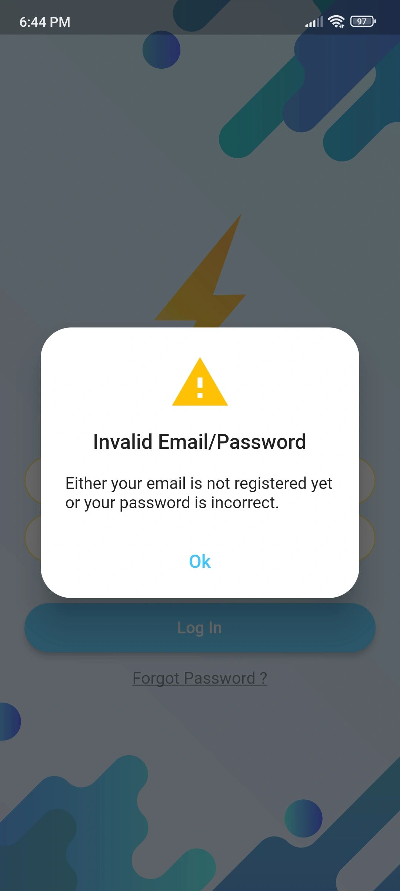
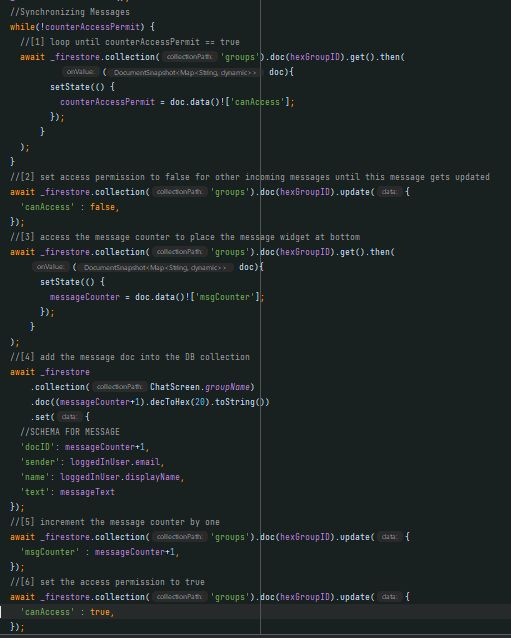

**Flash Chat** is a Real-time messaging android app connected to Firebase DB to store and
fetch the latest list of messages. Fireauth to authenticate users with
Signup/Login features. Applied Producer-Consumer approach for getting
messages in chronological order and avoiding Read-Write conflicts.

### [Download APK](https://github.com/Charan-Mudiraj/flashchat/raw/master/output_apk/Flash%20Chat.apk)

## Stack Used

- Dart
- Fireauth
- FIrebase DB
- Shared-Preferences Package

## Views

1. User Auth

   

2. Register

   

3. Login - user login status is stored in device memory

   

4. Add group feature

   

5. Additional group features

   

6. Chat screen

   

7. Logout Confirmation to remove user's login status from device memory.

   

8. Auth validation fail case

   

9. Code of Producer-Consumer approach for synchronizing Firebase messages list in chronological order and avoiding read-write conflicts.

   
